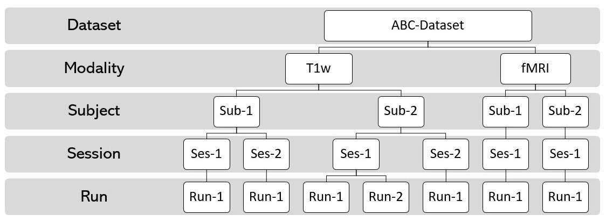

==============================================================
MRdataset : unified interface to various neuroimaging datasets
==============================================================

.. image:: https://img.shields.io/pypi/v/MRdataset.svg
        :target: https://pypi.python.org/pypi/MRdataset

.. image:: https://app.codacy.com/project/badge/Grade/4e6e129acb3340e3b422541be3924a90
        :target: https://app.codacy.com/gh/sinhaharsh/MRdataset/dashboard?utm_source=gh&utm_medium=referral&utm_content=&utm_campaign=Badge_grade

.. image:: https://github.com/sinhaharsh/MRdataset/actions/workflows/continuous-integration.yml/badge.svg
        :target: https://github.com/sinhaharsh/MRdataset/actions/workflows/continuous-integration.yml

* A unified interface to various neuroimaging datasets such as DICOM, BIDS and any other generic format etc.
* Documentation: https://open-minds-lab.github.io/MRdataset/

