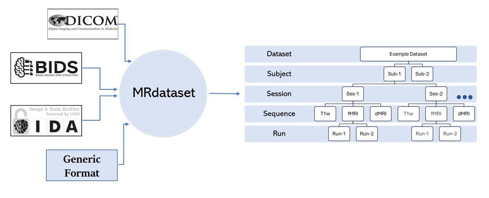

==============================================================
MRdataset : unified interface to various neuroimaging datasets
==============================================================

.. image:: https://img.shields.io/pypi/v/MRdataset.svg
        :target: https://pypi.python.org/pypi/MRdataset

* A unified interface to various neuroimaging datasets such as DICOM, BIDS and any other generic format etc.
* Documentation: https://open-minds-lab.github.io/MRdataset/

.. include:: ./usage.rst

Further
=======
.. toctree::
    :hidden:

    self

.. toctree::
   :maxdepth: 1

   installation
   API
   contributing
   authors

Indices and tables
==================
* :ref:`genindex`
* :ref:`modindex`
* :ref:`search`
