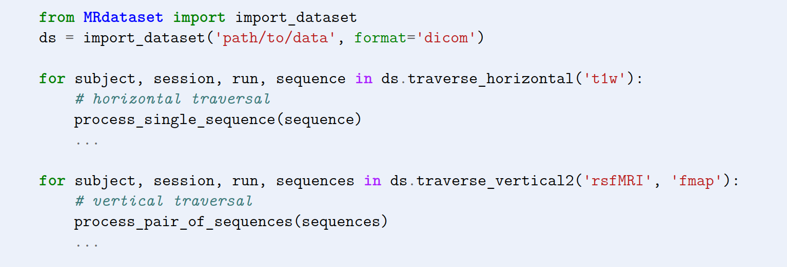

# Summary

Large-scale medical imaging datasets (e.g., MR, PET, CT) play a pivotal role in healthcare research. However, the reliability of their statistical results is contingent on the quality of the acquired data. These datasets are often acquired at multiple sites using diverse scanners, and formats. Divergent practices at individual sites and scanners lead to differences in acquisition and data organization. Manually reconciling these variations is not only time-consuming and labor-intensive but also error prone. To address this need, we developed MRdataset, a Python package that serves as a seamless interface to access diverse medical imaging dataset formats. MRdataset eliminates the burden of extensive re-formatting by accounting for differences in data organization, scanner specifications and various imaging formats.

# Statement of need

Medical imaging data is shared in various file formats (such as DICOM, NIfTI, Analyze) and organized differently for distinct study designs, and data capturing platforms (such as XNAT). The lack of standardized interfaces adds unnecessary complexity to the otherwise straightforward task of retrieving imaging sequences. This leads to significant inefficiencies and delays, hindering the seamless flow between data acquisition and analysis. MRdataset includes separate modules for handling each format (e.g., DICOM, NifTi) and the user can simply specify the format while reading the dataset. MRdataset provides a canonical data structure to offer researchers with a consistent API, regardless of the underlying file format or dataset structure on disk, thereby acting as a unified interface across various dataset formats.

Prior works (@Yarkoni2019, @brett_2023_7795644) have acknowledged the complexity of working with large scale, heterogeneous datasets. However, there has been limited emphasis on providing a unified interface for accessing various subjects and sequences without reformatting, that goes beyond one file format and dataset structure. It is important to note that in the normal course of a typical research project that involves many open datasets, importing, reformatting and validation of datasets typically occurs years after the data acquisition process has been completed. Relying on a specialized tool designed exclusively for a specific format is not practical. A unified interface helps decouple the analyses from the constraints and idiosyncrasies of various formats. Besides being user-friendly for accessing multiple formats, MRdataset enables direct access to sessions/subjects to facilitate sequence-level and subject-level analyses. MRdataset captures the broader perspective of reading the dataset as a whole and provides intuitive methods for horizontal traversal (across subjects for a given sequence) and vertical traversal (across multiple sequences for a given subject) as shown in \autoref{fig:schematic}. \autoref{fig:loops} shows an example of a script accessing subjects and sequences from a DICOM dataset.

In addition to the differences in study design and imaging formats, imaging scans also exhibit differences in MR physics parameters due to scanner vendors (such as Siemens, GE, and Philips) and hardware/software version updates. MRdataset accommodates such variations through custom classes for each acquisition parameter (via the protocol library we developed). These classes encapsulate contextual information, including their physical units, value range and their level of criticality to subsequent analyses. Utilizing specific classes for each acquisition parameter provides a rich, native and unambiguous representation of these parameters. They would also allow easy extensibility to accommodate distinct study designs and requirements. For example, we capture multiple echo times and flip angles in an array-like fashion although they are scattered in different DICOM slices. Subsequently, they are stored in a manner tailored to aligned with the needs of researchers.

Imaging datasets are often large (N>10,000), and parsing DICOM slice headers is slow, given each imaging session may have about 400 DICOM slices each. In order to efficiently process such large numbers and high I/O activity, we support partitioning for easy parallel processing e.g., on a HPC cluster and later merging them. Subsets can be processed individually using parallel processing and then can be merged together. A dataset may be divided based on subject groups, time of acquisition, acquisition protocol etc. By dividing the data into partitions, researchers can choose to work with specific subsets or merge only the relevant subsets for their analyses. For example, MRdataset captures scanner/site metadata. Researchers can analyze individual subsets from different sites to understand if any variations in image quality are site/scanner-specific, aiding in the identification of potential sources of confounding factors.

Healthcare research involves diverse equipment and evolving community standards that utilize distinct formats and acquisition protocols. Therefore, we would have to continue dealing with diverse formats and scanners. Hence, a well-designed interface with rich native representations for different parameters and formats is essential to simplify the traversal and manipulation of complex medical imaging datasets, allowing researchers to focus on scientific questions as opposed to details deep on the disk. Its versatility has already been demonstrated in facilitating a large study on over 20 open neuroimaging datasets with different formats for automatic protocol compliance assessment [@sinha2023solving].

# Acknowledgments

We acknowledge contributions from Tanupat Boonchalermvichien for their help with parsing some parts of the DICOM format in the initial stages.

# References
